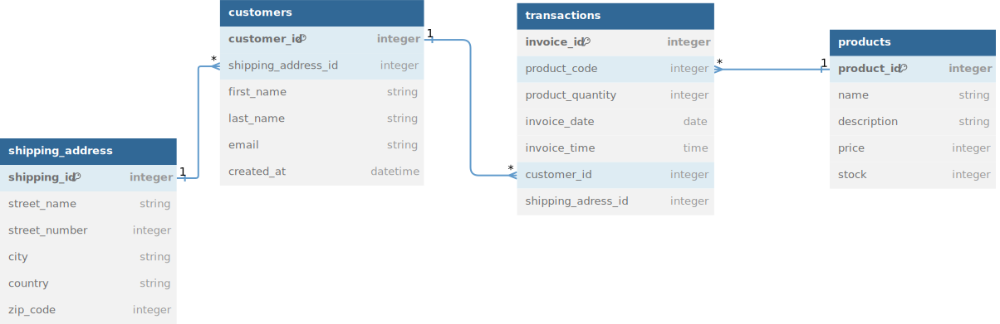
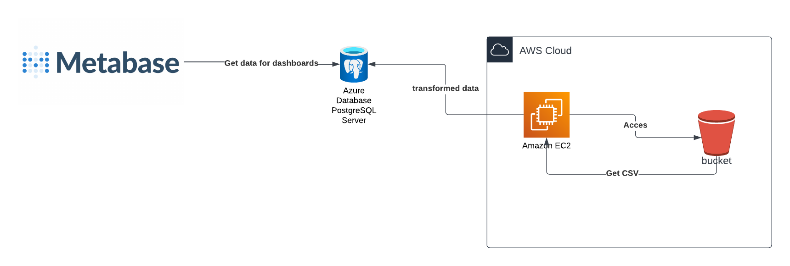

# Proyecto Bootcamp Data Engineer por Codigo Facilito

Mercado Free es una empresa de E-commerce que se dedica a la venta de productos a lo largo del mundo, la empresa ha tenido un crecimiento exponencial en los últimos años, por lo que ha decidido contratar a un Data Engineer para que realice un proceso de ETL para los datos generados por la empresa. Los datos se encuentran en un Bucket de S3 y se encuentran en formato CSV, el Data Engineer deberá realizar un proceso de limpieza y transformación de los datos, para finalmente ser almacenados en una base de datos relacional, en este caso, se utilizará PostgreSQL por su capacidad de manejar grandes volúmenes de datos y su capacidad de realizar consultas complejas.

> **_NOTE:_** El proceso de ETL se realizará en batch, es decir, se ejecutará una vez al día o cada cierto tiempo y no en tiempo real como seria en Streaming

## Herramientas a utilizar

1. Pixi (Manejador de paquetes de Python)
2. Pandas
3. Boto3
4. psycopg2
5. Metabase (Dashboards)

## Diagrama ER

## Servicios a utilizar

1. AWS S3
2. AWS EC2
3. Azure PostgreSQL
4. Metabase

## Flujo de procesos

